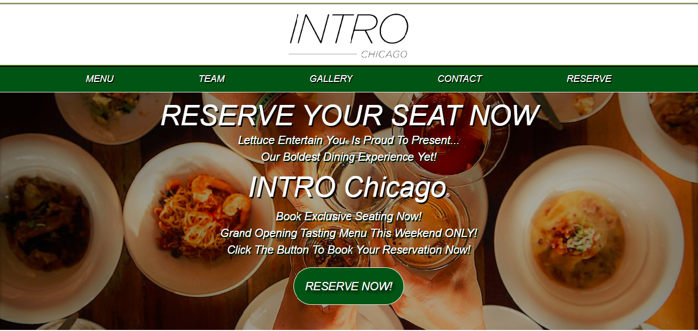

# INTRO CHICAGO - A Lettuce Entertain You® Concept

A new concept restaurant is coming to Chicago and INTRO Chicago needs a landing page built to for customers. 

## The Requirements for this project...
* The page must have a navigation bar with minimum of 5 links (links do not need to route)
* A form that validates the guest's mandatory information to create a reservation
* A footer 
* Must be responsive

## Additional Information for this project...
* Logo is included
* Make up color, content, and copy
* Adhere to accessibility guidelines
* Watermarks on images okay

## Technology
* HTML5
* CSS3 (Flex-Box)
* Javascript/jQuery
* Auto-Prefixer (CSS Compilier for Cross Browser Compatibility)
* Google Analytics (Goal tracker set to onClick event of `Submit Button`

## Resources Used
* Google®
* Mozilla Developer Network®
* StackOverflow®
* CSS Flex-Box Docs
* FreeCodeCamp.org
* LEYE® websites

# The Landing Page

